### 1. About
This is a simple tool to visualize data for a quick Exploratory Data Analysis (EDA). You can create various plot types as seaborn or plotly plot.
This is my first bigger python and first GUI project. The idea was to have with restricted time a fast result and good learning curve.

### 2. Features

#### Main Window
- Open CSV file
- Use Seaborn by default
- Check Plotly to use plotly
- Check Multiplot to create kind of subplots (Seaborn)
- Define how much rows and columns the multiplot should have
- Choose one of the loaded dataframes
- Depending on plot type, choose x-axis, y-axis, z-axis
- Choose plot type (RelPlot, PairPlot, JointPlot, DisPlot, CatPlot, LmPlot, 3DPlot, ManualPlot)
- See Console output for errors
- Click show plot to show the plot
- Click refresh to refresh the plot

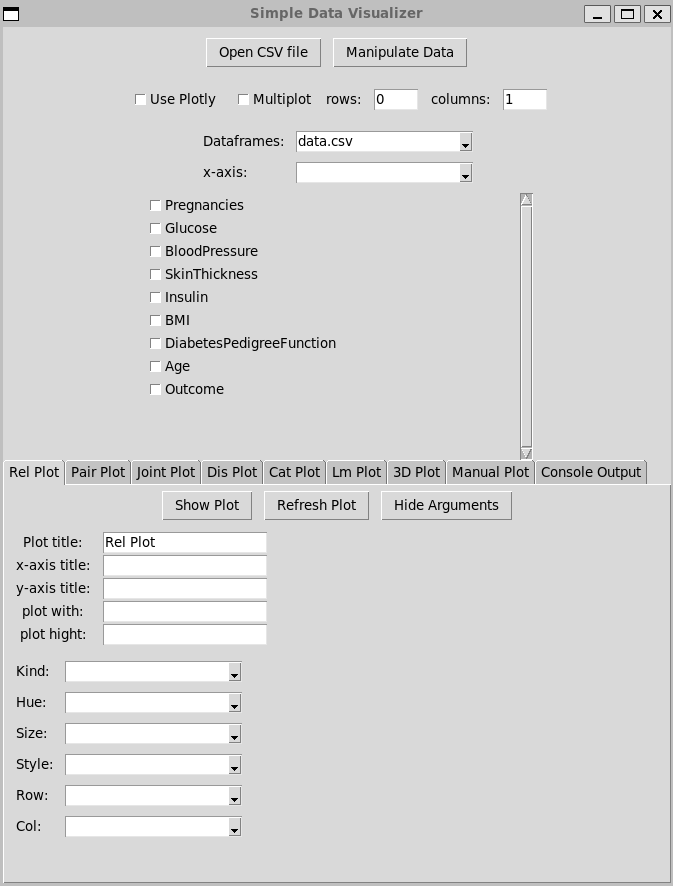 

#### Plots
**RelPlots (Seaborn, Plotly, Multiplot)**  
Create scatter and line relation plots with kwargs kind, hue, size, style, row, col.

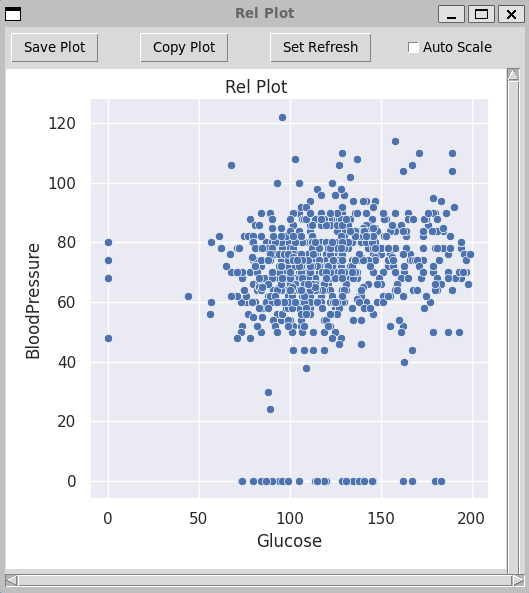 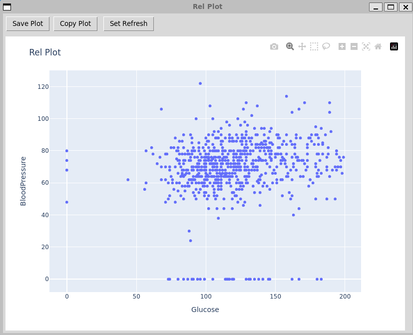

**PairPlots (Seaborn, Plotly)**  
Create pair plots with kwargs kind, diag_kind, hue, corner.

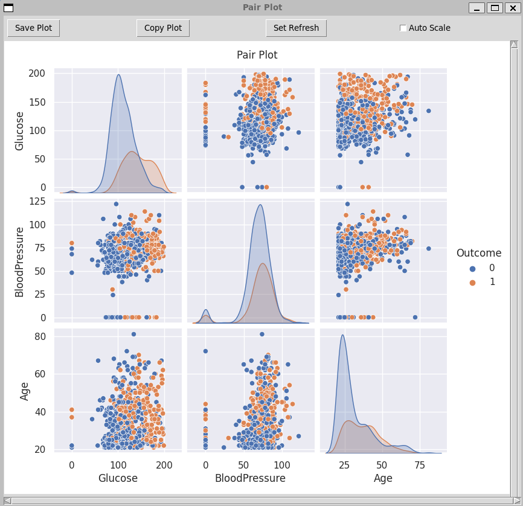 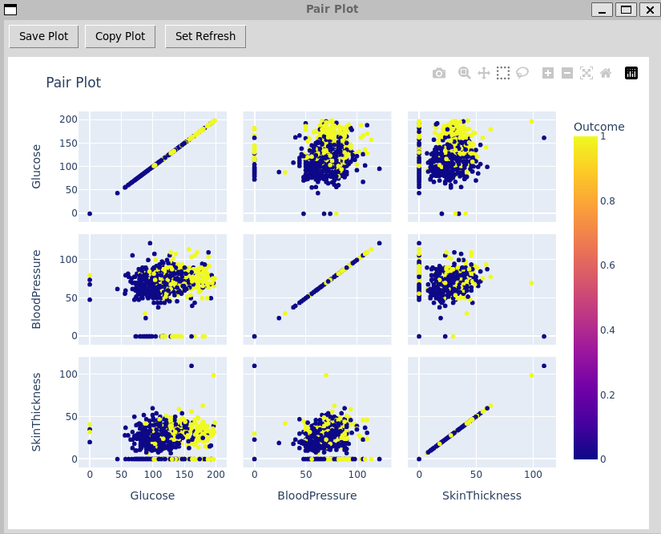

**JointPlot (Seaborn, Plotly, Multiplot)**  
Create joint plots with kwargs kind, hue.

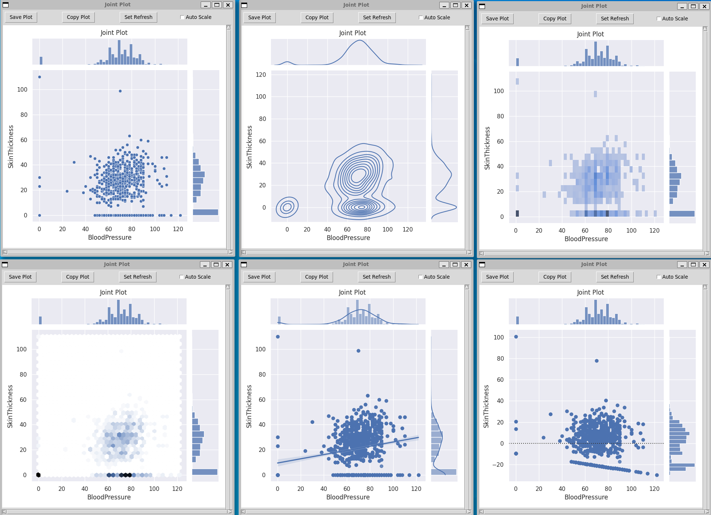 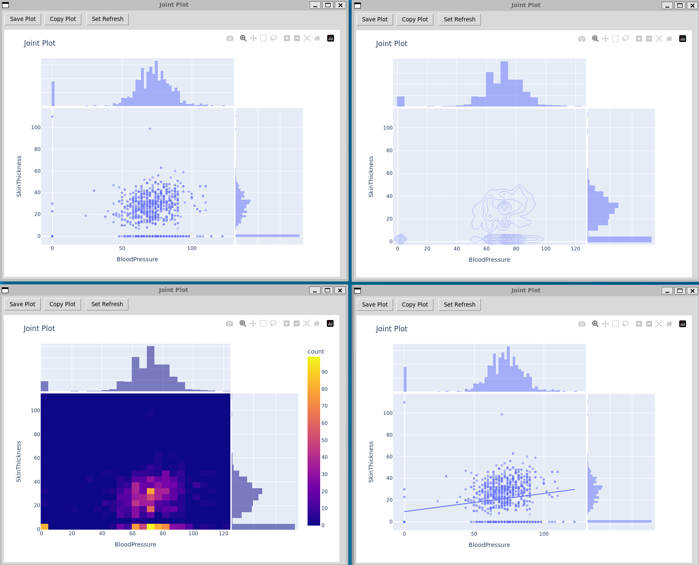

**DisPlot (Seaborn, Plotly, Multiplot)**  
Create distribution plots with kwargs kind, hue, rug, row, col.

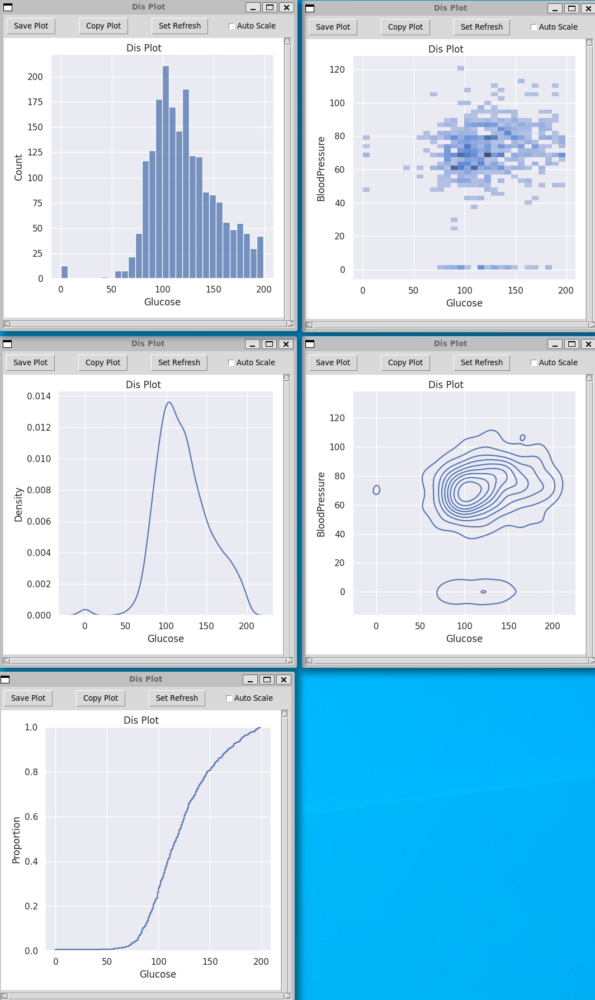 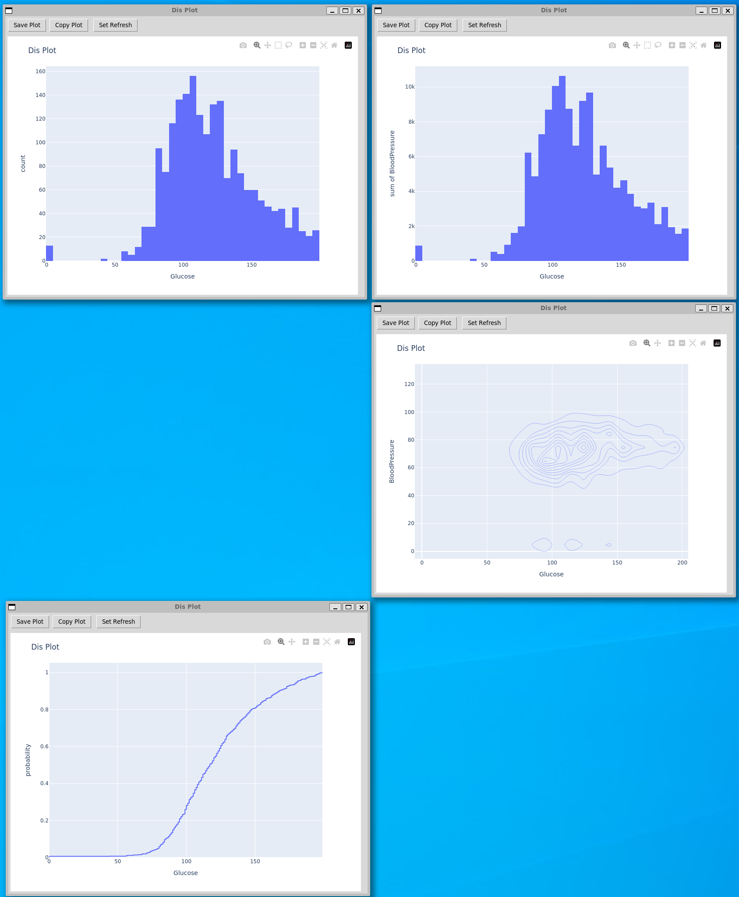

**CatPlot (Seaborn, Plotly, Multiplot)**  
Create categorical plots with kwargs kind, hue, row, col.

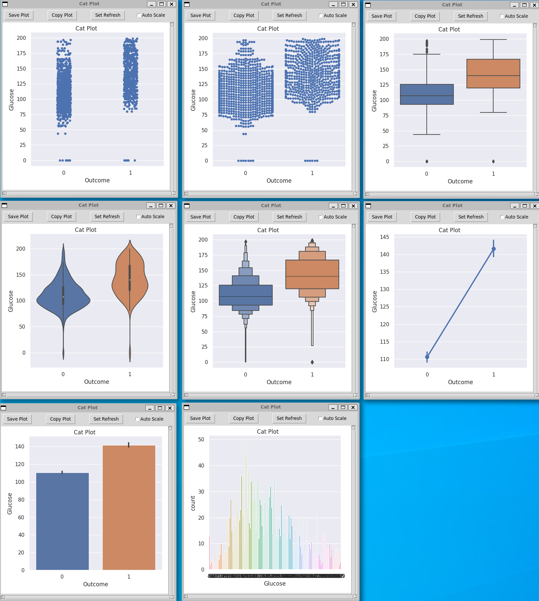 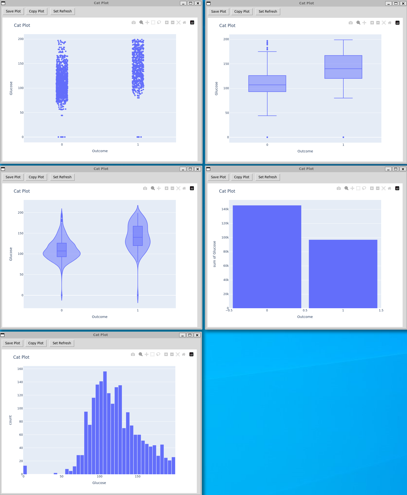

**LmPlot (Seaborn, Plotly, Multiplot)**  
Create linear model plots with kwargs heu, scatter, x_bins, robust, facet_kws, row, col.

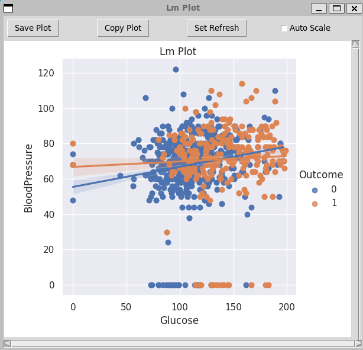 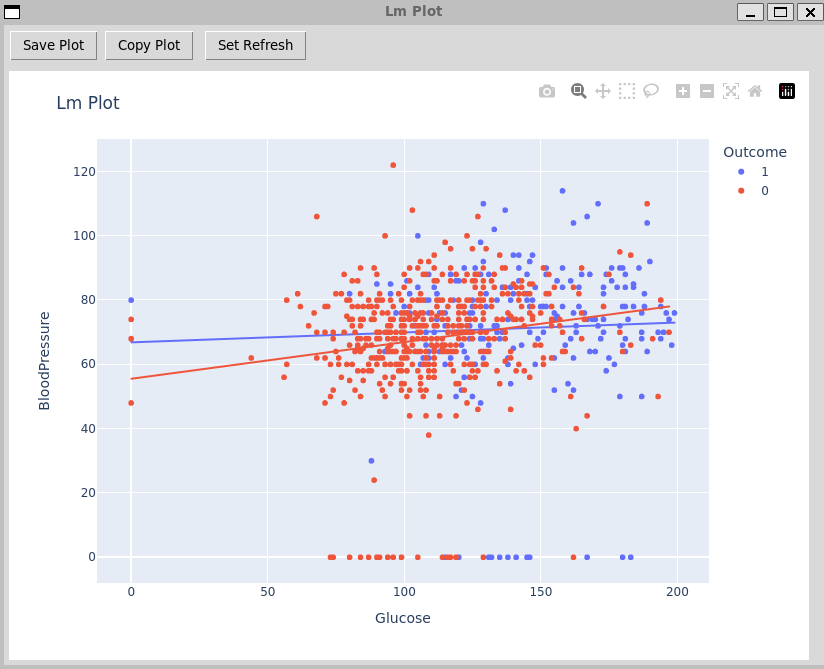

**3DPlot (Plotly)**  
Create 3D plots with kwargs hue, size, style.

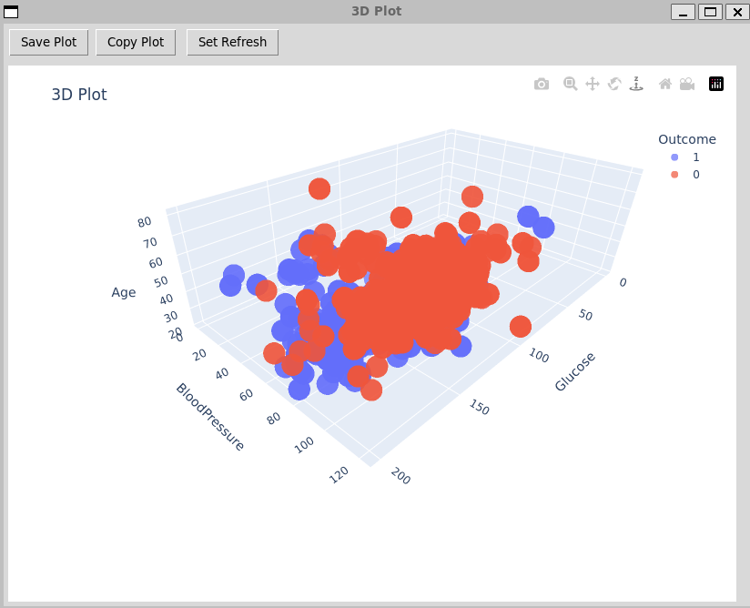

**ManualPlot (Seaborn, Plotly)**
You can incert full python code here which will be executed. Create a manual plot. Important is just that you return a figure object.
You can also manipulate the data by manipulating or redifining the df.

**General fields**
- Plot/ x-axis/ y-axis/ z-axis title
- plot with (seaborn/multiplot: inches, plotly: pixels)
- plot height (seaborn/multiplot: inches, plotly: pixels)

#### Window Features  
**Save Plot** (Seaborn, Plotly, Multiplot))  
Click save plot to save the plot as a .png file.

**Copy Plot** (Seaborn, Plotly, Multiplot)
Click copy plot to copy the plot to the clipboard.

**Set Refresh** (Seaborn, Plotly, Multiplot)  
Click set refresh to refresh an existing window with the new plot. A window can just be refreshed with the same window type. (Seaborn, Plotly, Multiplot)

**Auto Scale** (Seaborn)  
Ceck auto scale to resize the plot when changing the window size.

#### Manipulate Data  
Here you can manipulate the data with the following options:
- delete columns
- set data type
- set datetime index
- create new columns by addition, subtraction, multiplication, division
- filter data
- save as csv
- duplicate dataframe
- view datatypes  

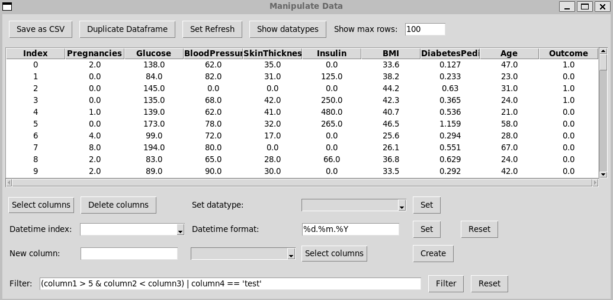

  

### 3. Installation

#### Linux
You need python version 3.7.
##### Install pyenv as a python version manager
You can install pyenv via pyenv-installer or the system's package manager.  
A generic way using pyenv-installer is as follows:  
`curl https://pyenv.run | bash`

- After installation, you need to add pyenv initialization lines to the shell configuration file (like ~/.bashrc, ~/.zshrc, etc.):  
`export PATH="$HOME/.pyenv/bin:$PATH"`  
`eval "$(pyenv init --path)"`  
`eval "$(pyenv virtualenv-init -)"`  

- Then, you should restart your shell or re-source the configuration file:  
`source ~/.bashrc`  # Or the respective config file

- Now, you can install Python 3.7.16 using pyenv:  
`pyenv install 3.7.16`

- After installation, set the desired Python version as global (or local for a specific project directory) using pyenv:  
`pyenv global 3.7.16`

##### Clone the repository
`git clone git@github.com:Dsite42/Simple_Data_Visualizer.git`

##### Install the dependencies
`pip install -r requirements.txt`

##### Running the Simple Data Visualizer
`python main.py`

### 4. Usage and Examples

